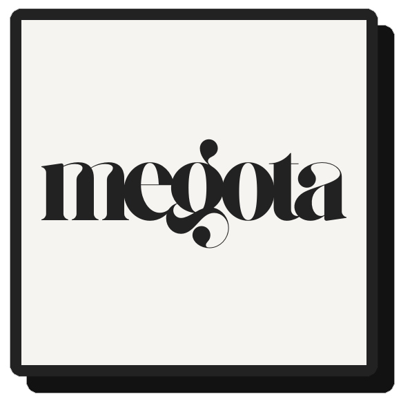

<h1>
    <picture>
        <source media="(prefers-color-scheme: dark)" srcset="assets/favicon.png">
        
    </picture>
</h1>

[](https://github.com/Unreal-Works/megota/actions/workflows/docs-deploy.yml)
[](https://github.com/Unreal-Works/megota/releases/latest)
[](https://www.codefactor.io/repository/github/Unreal-Works/megota)

A powerful TypeScript/JavaScript library for handling arithmetic with extremely large numbers, supporting values up to $\lbrace 10, 9e15, 1, 1, 2 \rbrace $ and beyond standard number formats.

## Features

- **Unlimited Magnitude**: Process numbers far beyond JavaScript's native limitations
- **Extensive Operations**: Support for standard arithmetic, trigonometric functions, logarithms, tetration, and advanced hyperoperations
- **Multiple Notations**: Parse and work with multiple notation formats for enormous numbers
- **Full TypeScript Support**: Comprehensive type definitions for improved developer experience

## Installation

```bash
npm install megotanumber
```

## Quick Start

```javascript
import MegotaNumber from 'megotanumber';

// Basic operations
const a = MegotaNumber.fromString('10^100');  // 10 googol
const b = MegotaNumber.fromNumber(1000);      // 1000

// Arithmetic operations
const sum = a.add(b);            // 10^100 + 1000
const product = a.mul(b);        // 10^100 * 1000
const power = b.pow(a);          // 1000^(10^100)

// Advanced operations
const tetrated = MegotaNumber.TEN.tetrate(MegotaNumber.fromNumber(3));  // 10^10^10
const c = MegotaNumber.fromString('J^63');    // Using PsiCubed2's Letter Notation

console.log(a.toString());        // "1e100"
console.log(tetrated.toString()); // "10^^3"
console.log(c.toString());        // "J^63"
```

## Notations Supported

MegotaNumber incorporates several different notation systems for representing extraordinarily large numbers:

### [Knuth's Up-Arrow Notation](https://en.wikipedia.org/wiki/Knuth%27s_up-arrow_notation)
- $a ↑↑ b$ refers to a tetrated to b
- Example: $10 ↑↑ 3$ represents $10^{10^{10}}$

### [X-Sequence Hyper Notation](https://googology.fandom.com/wiki/X-Sequence_Hyper-Exponential_Notation)
- $a \lbrace x \rbrace b$ refers to $a \underbrace{\uparrow\uparrow...\uparrow}_{x\space arrows} b$
- Example: $4 \lbrace 5 \rbrace 3$ represents $4 ↑↑↑↑↑ 3$ (4 heptated to 3)
- Rules: $a \lbrace 1 \rbrace n = a^n$ and $a \lbrace x \rbrace 1 = a$

### [Bower's Exploding Array Function](https://googology.fandom.com/wiki/Bowers%27_Exploding_Array_Function)
- $\lbrace a, b, c, d \rbrace  = a \lbrace c \rbrace ^db$, where d is the number of sets of braces
- Example: $\lbrace 3, 3, 2, 1 \rbrace $ represents $3 \lbrace 2 \rbrace 3 = 3^{27}$
- Rules:
  - $\lbrace a, b, 1, 1 \rbrace  =  \lbrace a, b \rbrace  = a \lbrace 1 \rbrace b = a ↑ b$
  - $\lbrace a, 1, c, d \rbrace  = a \lbrace c \rbrace ^d1 = a$
  - $\lbrace a, b, 1, d \rbrace  =  \lbrace a, a,  \lbrace a, b - 1, 1, d \rbrace , d - 1 \rbrace , b, d > 1$
  - $\lbrace a, b, c, d \rbrace  =  \lbrace a, b,  \lbrace a, b - 1, c, d \rbrace , d - 1 \rbrace , b > 1$

### [PsiCubed2's Letter Notation](https://googology.fandom.com/wiki/User_blog:PsiCubed2/Letter_Notation_Part_II)
- $Ex = 10 \lbrace 1 \rbrace x,\space Fx = 10 \lbrace 2 \rbrace x,\space Gx = 10 \lbrace 3 \rbrace x,\space Hx = 10 \lbrace 4 \rbrace x$
- Example: $E100$ represents $10^{100}$ (googol)
- Diagonalization: $Jx = 10 \lbrace x \rbrace 10$
- Extended: $Nx =  \lbrace 10, \lfloor x \rfloor +1, 2 \cdot 5^{ frac(x) }, \lfloor x \rfloor \rbrace $, where $frac(x)$ is the fractional part of $x$.

### [Fast-Growing Hierarchy](https://en.wikipedia.org/wiki/Fast-growing_hierarchy)
- $f_{\omega^2+1}$ approximately corresponds to megotional growth rate
    - [Megotion](https://googology.wikia.org/wiki/Megotion) refers to $\lbrace a, b, 1, 1, 2 \rbrace $
- This library supports up to $\lbrace 10, 9e15, 1, 1, 2 \rbrace $

## Acknowledgements

This project is a fork of [MegotaNum.js](https://github.com/sonic3XE/MegotaNum), originally created by [sonic3XE](https://github.com/sonic3XE).

Code snippets and templates were borrowed from [Decimal.js](https://github.com/MikeMcl/decimal.js/) by [Naruyoko](https://github.com/Naruyoko).

## License

MIT